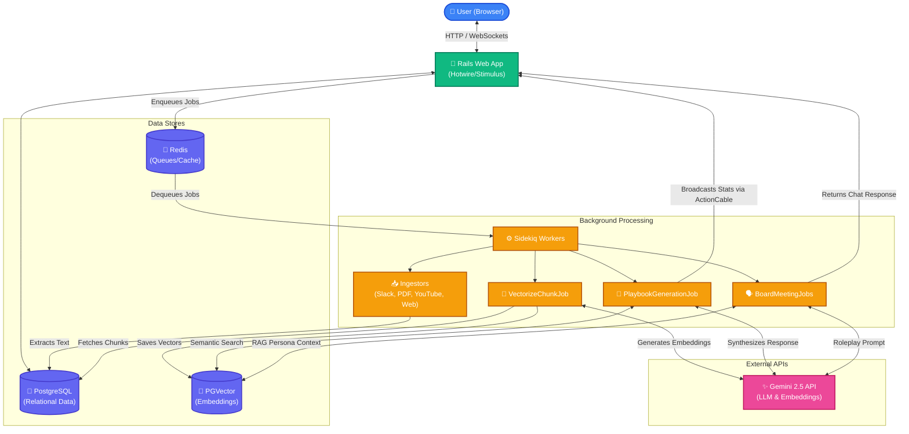

# PodcastAi (formerly Product God)

Welcome to **PodcastAi**, an advanced AI-powered platform designed to extract, synthesize, and interact with the knowledge buried in podcasts, documents, and chat logs. 

---

## 🌟 For Non-Technical Users (Overview)

Have you ever listened to an amazing podcast or read a brilliant PDF and thought, "I wish I could ask the guests questions about my specific problem?" **PodcastAi** makes that possible.

### What does PodcastAi do?
1. **Knowledge Ingestion**: It reads and listens. We feed it YouTube podcast transcripts, PDFs, WhatsApp chats, Slack exports, and web pages.
2. **AI Playbooks**: Tell the system your goal (e.g., "How do I launch a new product strategy?"), and it will synthesize the best advice from all the ingested experts into a personalized, step-by-step markdown playbook.
3. **Board Meeting Simulator**: Imagine putting three of your favorite podcast guests in a virtual room to debate your company's strategy. The Board Meeting Simulator does exactly this, allowing you to moderate and interact with AI personas of real thought leaders.
4. **Knowledge Graph**: A visual explorer that connects the dots between different guests, companies, and concepts. 

At its core, PodcastAi turns static audio and text into a **living, interactive brain trust**.

---

## 💻 For Technical Users (Developer Guide)

PodcastAi is a modern, monolithic Ruby on Rails application leveraging advanced AI models (Gemini) and vector databases for Retrieval-Augmented Generation (RAG).

### Tech Stack
*   **Framework**: Ruby on Rails 7.1
*   **Database**: PostgreSQL with `pgvector` (for vector embeddings and semantic search)
*   **Background Jobs**: Sidekiq + Redis
*   **Frontend**: Hotwire (Turbo + Stimulus), TailwindCSS, Cytoscape.js (for graph visualization)
*   **AI Integration**: `ruby_llm` gem wrapping Gemini 2.5 Pro & text-embedding-004
*   **Markdown**: Commonmarker (for high-fidelity rendering)

### System Requirements
*   Ruby `3.2.1`
*   PostgreSQL (with `pgvector` extension)
*   Redis (for Sidekiq and Turbo Streams)
*   Gemini API Key (set via environment variables)

### Setup Instructions
1. **Clone & Install Dependencies**:
   ```bash
   bundle install
   yarn install # or npm install if applicable
   ```

2. **Database Setup**:
   Ensure PostgreSQL is running and `pgvector` is installed on your system.
   ```bash
   bin/rails db:create
   bin/rails db:migrate
   ```

3. **Background Services**:
   Start Redis server:
   ```bash
   redis-server
   ```

4. **Run the Application**:
   Use Foreman to boot Rails, Tailwind watchers, and Sidekiq:
   ```bash
   bin/dev
   ```

5. **Initial Data Ingestion (Optional)**:
   To populate the system with base data (e.g., Lenny's Podcast transcripts):
   ```bash
   bin/rails runner "IngestionService.new.call"
   bin/rails knowledge_graph:backfill
   ```

---

## 🏛 Architecture

PodcastAi uses a modular monolith design where ingestion, embedding, and generation are decoupled via background jobs to maintain web request speed.

### Core Workflows

1. **Ingestion Pipeline**: Text from various sources (YouTube, Slack, etc.) is parsed, broken down into manageable chunks using `Tiktoken`, and stored as `ContentChunk` records.
2. **Vectorization**: Background jobs (`VectorizeChunkJob`) generate embeddings for each chunk using Gemini's embedding model and store them in `pgvector`.
3. **Retrieval (RAG)**: When a user asks a question or generates a playbook, the `RagSearchService` embeds the query, performs a cosine similarity search against `pgvector`, and constructs an LLM prompt with the retrieved context.
4. **Knowledge Graph Extraction**: The `ExtractionService` periodically passes chunks to the LLM to identify entities (`GraphNode`) and relationships (`GraphEdge`), which are visualized via Cytoscape.js.

### Architectural Diagram



### Key Modules & Directories

*   `app/models`: Core data entities (`ContentChunk`, `GraphNode`, `Episode`, `Playbook`, `BoardMeeting`).
*   `app/services/ingestors`: Handlers for parsing Slack (`slack.rb`), PDFs (`pdf.rb`), web pages (`web.rb`), and WhatsApp (`whats_app.rb`).
*   `app/services`: High-level orchestrators (`RagSearchService`, `KnowledgeGraph::ExtractionService`, `BoardMeetingService`).
*   `app/jobs`: Async processors that handle the heavy lifting for external API calls and long-running generation tasks.
